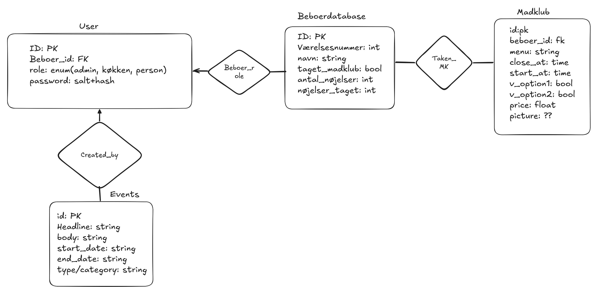

# DIS_PROJECT_Group75
Anton Vesterbæk - KU ID: mjh161


Mathias Hilger - KU ID: smj563


Simon Thrane - KU ID: dbs611

# About the project
This project is oriented for dormmates who are looking for an easy way to keep themselves oriented on foodclubs, kitchen cleanings etc. By this we've created a database and a small frontend to represent the data from the database. We use the databases to keep track of the amount of foodclubs and cleanings that each person has made, and also for others to keep track of. Other people should also be able to see whats for dinner and sign up for the foodclubs.

## E/R Diagram


# Install Dependencies

**Docker (recommended):** Install [Docker Desktop](https://docs.docker.com/get-docker/), then from the project folder run:

```bash
docker compose up --build
```

Open http://localhost:5000. Seeded login credentials are printed in the terminal during startup.

**Manual setup:** Install [PostgreSQL](https://www.postgresql.org/download/) (user `postgres`, password `postgres`, port `5432`)

 Then:

```bash
pip install -r requirements.txt
python database.py
python seed-db.py
python app.py
```

Open http://127.0.0.1:5000.


# Website interaction instructions
To access the site, you have to login. The logins are saved in the 'user_table' relation, and gives you access to register new foodclubs and join existing ones. You make your own user at http://127.0.0.1:5000/signup, and login at http://127.0.0.1:5000/login. 

# Shortcommings
We decided not to include events and cleaning schedule and focused purely on the foodclubs due to time constraints.  

# AI-Declaration
We have not used generative AI to generate code during the development of this project. We have used AI regarding some issues concerning managing virtual enviroments and installing packages. 